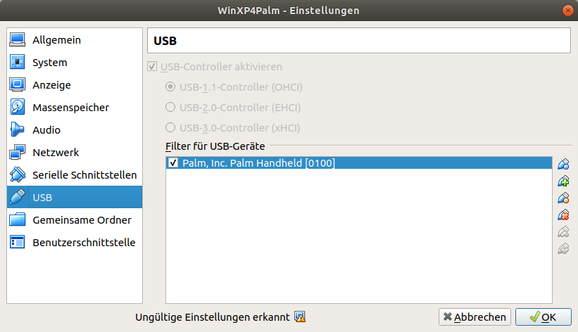
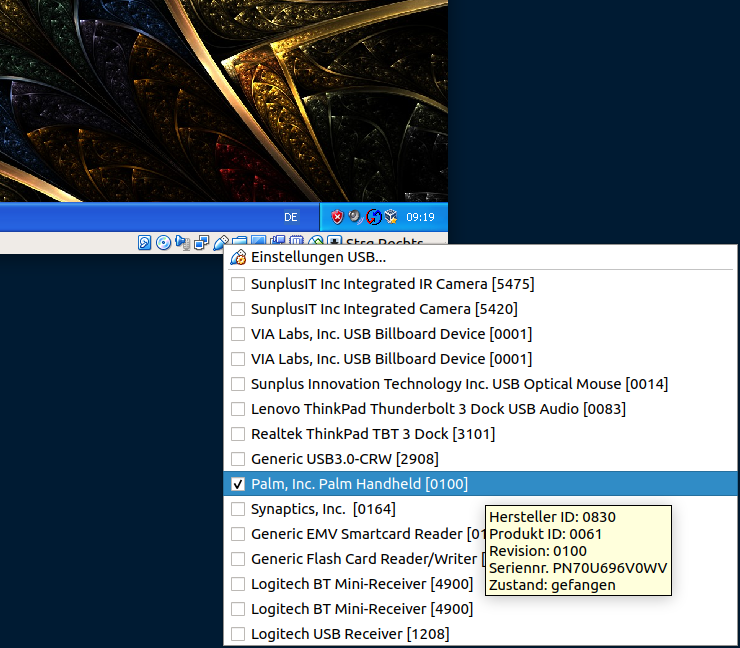

# Getting Palm Desktop software to work in a Virtual Box

Simplest way to get your Palm to work (again) is to use the original software, that is Windows XP and Palm Desktop.
Using a virtual machine this works on all platforms pretty much the same way.

## Instructions for Ubuntu/Linux

- install virtual box
- create a Windows XP (32bit) machine
- install guest extensions (for USB 2 support)

Blacklist the `visor` kernel module by editing `/etc/modprobe.d/blacklist.conf` and add a line:

```
# to pipe palm usb connection unmodified through to Virtual Box
blacklist visor
```

After (a potential reboot) connecting the USB cable to the Palm should print out the following log messages (via `dmesg`):


```
[  361.936145] usb 1-2: new full-speed USB device number 17 using xhci_hcd
[  362.085276] usb 1-2: New USB device found, idVendor=0830, idProduct=0061, bcdDevice= 1.00
[  362.085282] usb 1-2: New USB device strings: Mfr=1, Product=2, SerialNumber=5
[  362.085285] usb 1-2: Product: Palm Handheld
[  362.085289] usb 1-2: Manufacturer: Palm, Inc.
[  362.085291] usb 1-2: SerialNumber: PN70U696V0WV
```

*Mind:* there _must not_ be lines like:

```
visor 1-2:1.0: Handspring Visor / Palm OS converter detected
usb 1-2: Handspring Visor / Palm OS converter now attached to ttyUSB0
usb 1-2: Handspring Visor / Palm OS converter now attached to ttyUSB1
```

in the printout - if there are, then the `visor` module is still being loaded.

*Note:* The `visor` module is needed for the native pilot-link-tools. So you have to decide whether you'd like to use the WindowsXP+Virtual Box sync, _or_ the pilot-link-tools.

## Virtual Box usb config

Virtual box must be configured to use USB:



When booting up WinXP in the virtual box, the USB info panel (bottom right, use right-click to show)
should list the Palm device.



## Palm Hotsync setup

TOOO : it took me a few trial and error sessions to get this working. Best would be if I start from scratch with a new VB and document all the individual steps needed....

- Network connection (USB won't work)
- Setup hotsync in Palm
- hotsync button won't work, always start via screen tap
- ....
